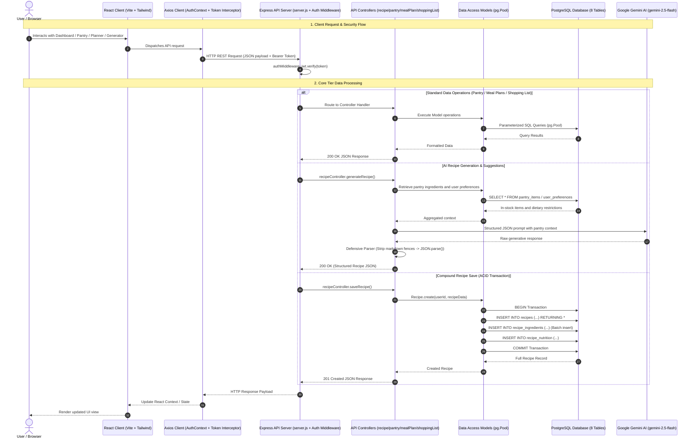
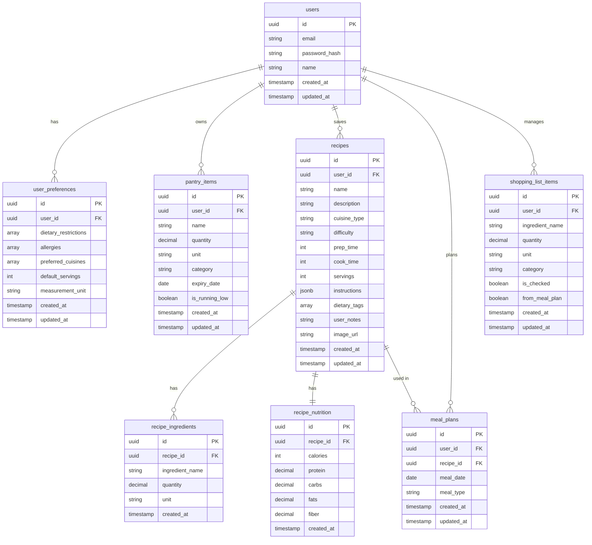
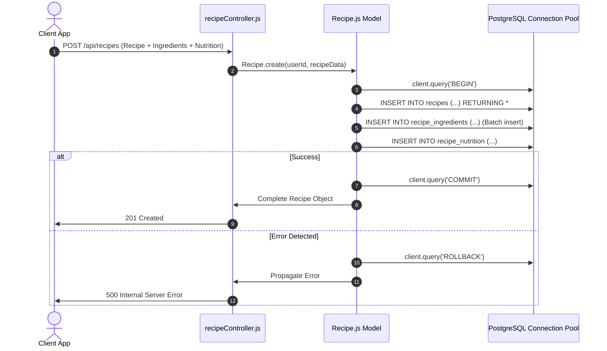
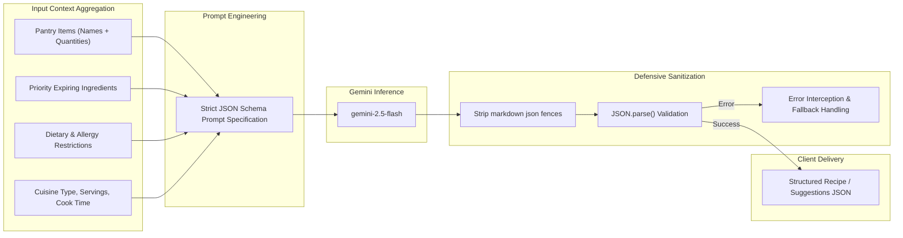
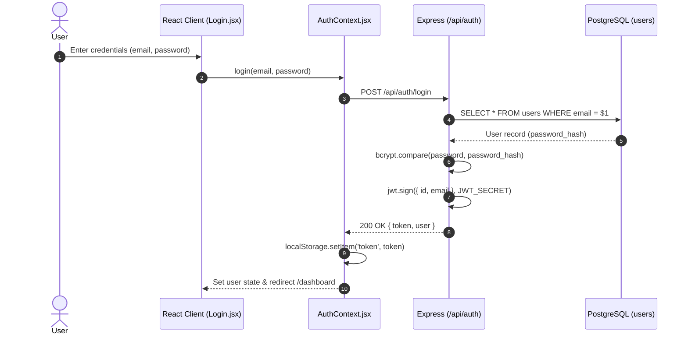
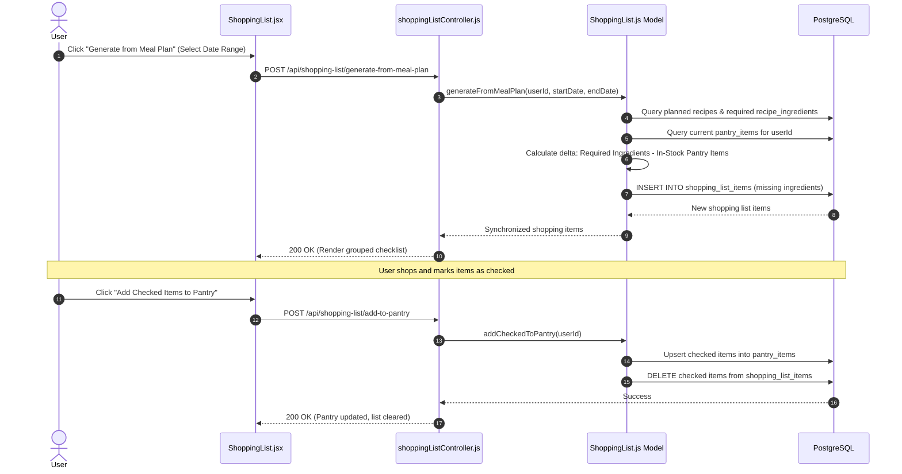
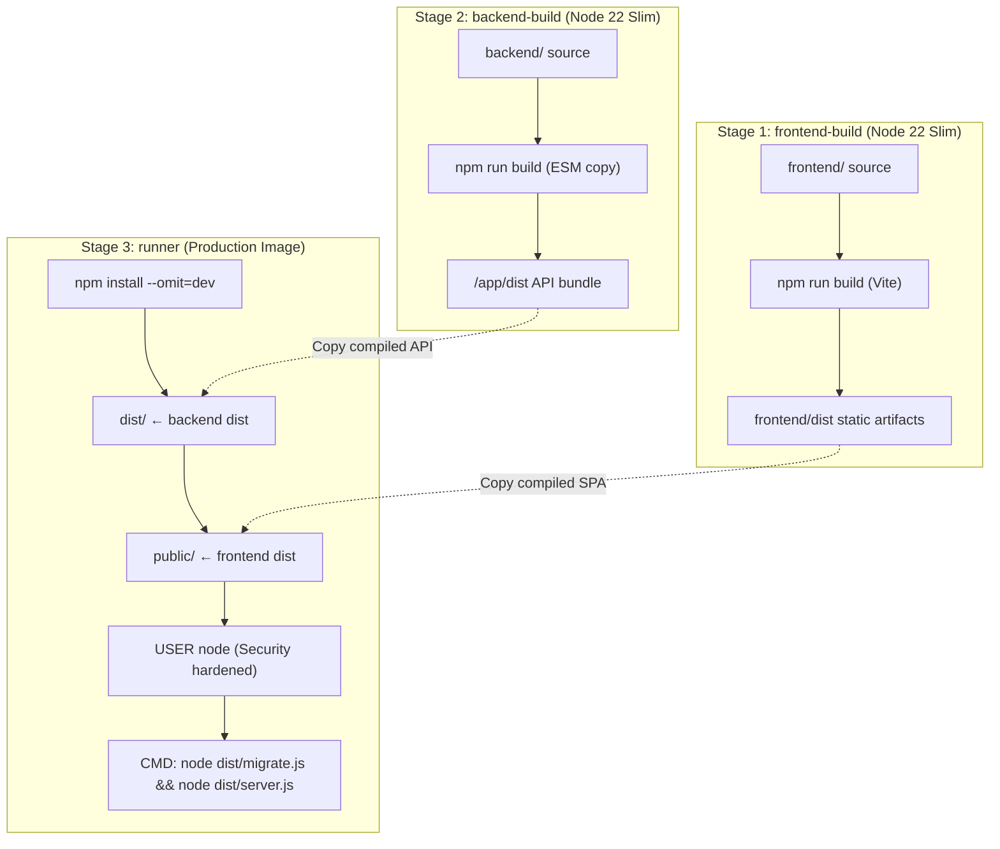

# Chef Mind — System Architecture & Design Specification

> **AI-Powered Culinary Assistant, Pantry Intelligence & Meal Planning Platform**

---

## 1. System Architecture & Data Flow

Chef Mind is a 4-tier web platform built with **React (Vite)**, **Node.js/Express**, **PostgreSQL**, and **Google Gemini AI**.

---

## 2. Database Architecture (Entity-Relationship Diagram)

The database schema utilizes **8 PostgreSQL tables** 

### Multi-Table Atomic Transaction (Recipe Persistence)

Saving a recipe executes an atomic ACID transaction across `recipes`, `recipe_ingredients`, and `recipe_nutrition` via [`Recipe.create()`](file:///D:/project/good/good/chef_mind/backend/src/models/Recipe.js):

---

## 3. AI Pipeline & Capabilities (Google Gemini Integration)

Google Gemini (`gemini-2.5-flash`) handles all generative culinary intelligence via [`backend/src/utils/gemini.js`]

---

## 4. End-to-End Core Data Flows

### 4.1 Authentication & Session Token Lifecycle

### 4.2 Meal Plan to Smart Shopping List Reconciliation

---

## 5. Deployment & Containerization Architecture

Chef Mind builds as a single container image using a 3-stage [`Dockerfile`]

